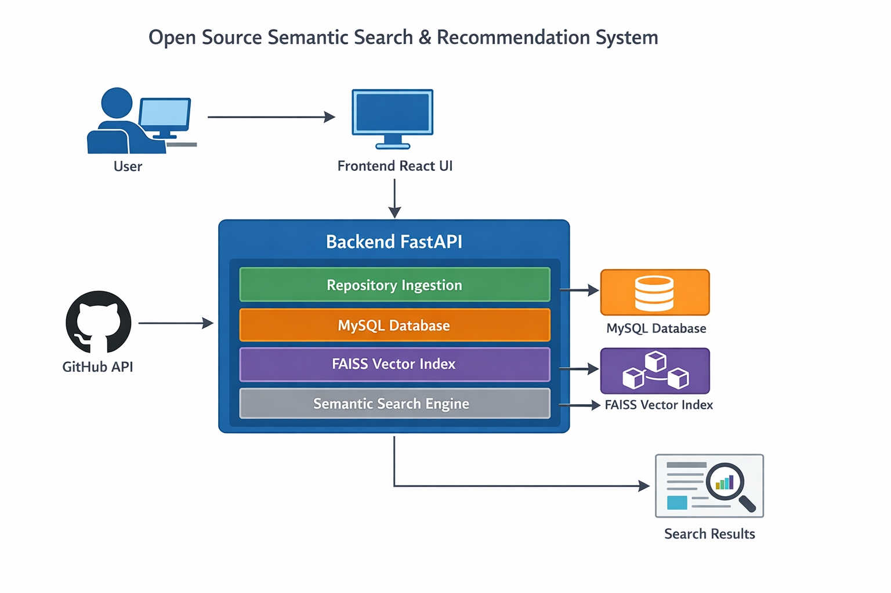

# 🔎 Open Source Semantic Search & Recommendation System


An intelligent search system designed to help developers discover relevant open-source repositories using natural language queries.

This project improves traditional keyword-based search by combining semantic search, repository embeddings, vector similarity search, and a user-friendly web interface.

The system analyzes repository metadata and README content to return repositories that are more semantically related to a user's intent.

---

# 📌 Overview

Finding useful open-source repositories with traditional keyword search can be difficult because results often depend on exact word matches.

This project addresses that limitation by applying semantic understanding to repository descriptions and README files.

Users can search with natural language queries, and the system returns repositories that are semantically similar to the query, rather than only matching exact keywords.

Instead of matching a few keywords only, the system finds repositories whose README content, description, and overall project meaning are relevant to the query.

---

# 🎯 Motivation

Developers often struggle to find suitable open-source repositories using traditional keyword-based search.

Common problems include:

Relevant repositories not appearing in search results

Difficulty discovering projects with similar functionality

Over-reliance on exact keyword matches

Inefficient exploration of open-source ecosystems

This project aims to solve these issues by introducing:

- **Semantic repository search**
- **Vector similarity search**
- **Natural language query support**

---

# ✨ Key Features

### 🔎 Semantic Repository Search

Search repositories using **natural language queries** instead of exact keywords.

The system finds repositories whose **README and description match the meaning of the query**.

---

### 🧠 Vector Similarity Search

Repository information is converted into **vector embeddings** and indexed for fast similarity search using **FAISS (Facebook AI Similarity Search)**.

---

### 📦 GitHub Repository Ingestion

The system retrieves repository data from GitHub including:

- Repository metadata
- Repository description

These data are stored in a database and used to build the search index.

---

### 🖥 Web-Based Interface

A **React-based** frontend provides an intuitive UI that allows users to:

- Enter natural language queries

- Set the number of results to retrieve

- Search repositories through the semantic search pipeline

- View repository metadata in card format

- Open GitHub repository pages directly

- Clear stored repository data from the database

---

# 🏗 System Architecture



---

# ⚙️ Search Pipeline

The semantic search pipeline works as follows:

```
User Query
   │
   ▼
SentenceTransformer Embedding
   │
   ▼
Vector Similarity Search
   │
   ▼
Top-K Repository Results
   │
   ▼
Repository Metadata Retrieval
   │
   ▼
Search Results Display
```

Current backend search sequence:

```
POST /ingest
   ↓
POST /build-index
   ↓
GET /semantic-search
```

---

# 🛠 Tech Stack

## Frontend

- React  
- Axios  
- CSS

## Backend

- FastAPI  
- Python  
- Pydantic
- SQLAlchemy

## Database

- MySQL  

## Machine Learning / Search

- SentenceTransformers  
- FAISS (Vector Similarity Search)

## External API

- GitHub REST API

---

# 📂 Project Structure

```
open_source_recommendation
│
├── backend
│   ├── main.py
│   ├── db.py
│   ├── models.py
│   │
│   ├── services
│   │   └── embedding_service.py
│   │
│   ├── faiss_index
│   │
│   └── requirements.txt
│
├── src
│   ├── App.js
│   └── App.css
│
├── public
│
├── package.json
└── README.md
```

---

# ⚙️ Installation

## 1. Clone the repository

```
git clone https://github.com/JiHoon915/OpenSourceSearchEngine.git
cd OpenSourceSearchEngine
```

## 2. Backend Setup
Install backend dependencies:

```
pip install -r backend/requirements.txt
```

Create a .env file in the project root and add your GitHub token:

```
GITHUB_TOKEN=your_github_token_here
```

Run the backend server:

```
uvicorn backend.main:app --reload
```

## Frontend Setup

Install frontend dependencies:

```
npm install
```

Start the frontend development server:

```
npm start
```

---

# 🚀 Usage

Typical workflow:

### 1️⃣ Import repositories from GitHub
### 2️⃣ Build the search index
### 3️⃣ Perform semantic search

---

# 🔮 Future Work

Planned improvements include:

- Interactive query refinement
- More efficient indexing workflow
- Personalized repository recommendations
- Scalable deployment in a cloud environment
- Search analytics and performance monitoring

---

# 👨‍💻 Author

**JiHoon Yoo**

Software Engineering  
Sungkyunkwan University

---

# 📜 License

This project is developed for **academic and research purposes**.